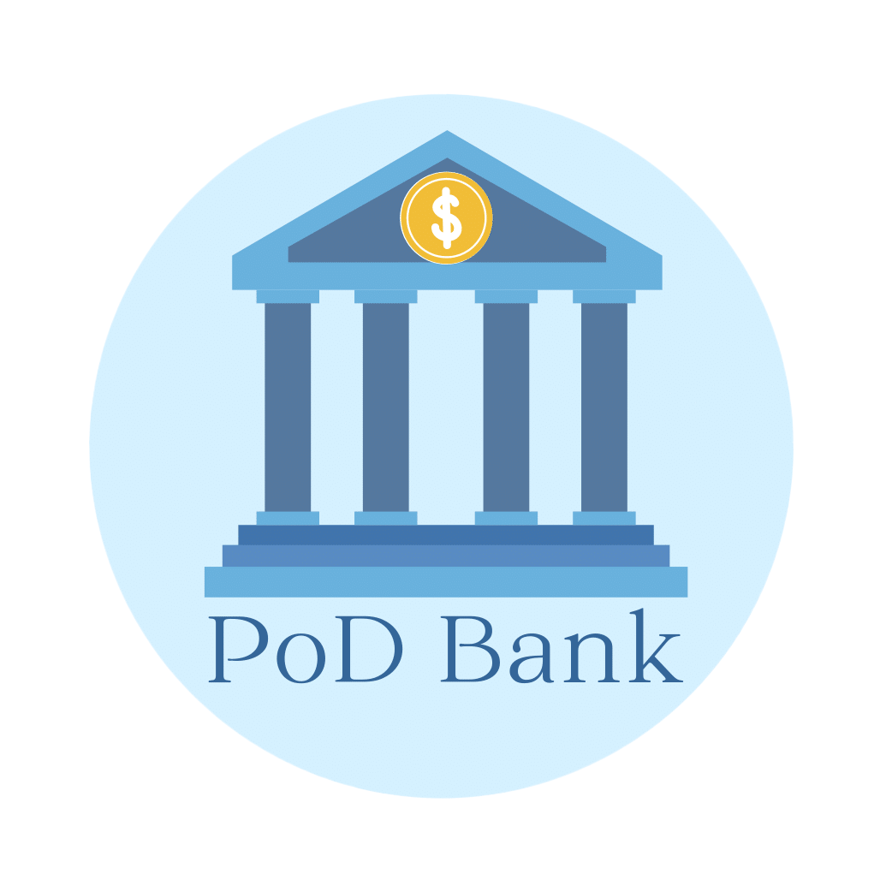
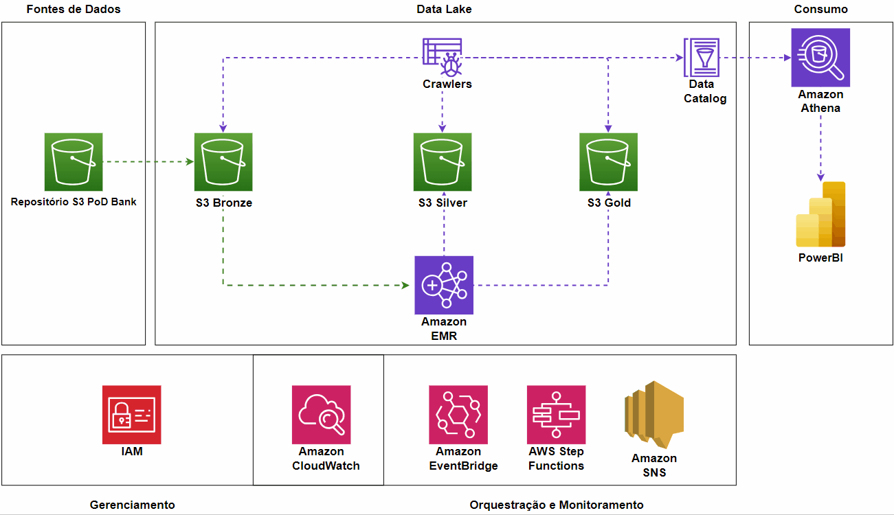

# pod-bank



## Introdução

Este projeto aborda o desenvolvimento de um Data Lake para a empresa PoD Bank que atenda os seguintes requisitos:

- dados catalogados, 
- fontes de dados catalogadas, 
- processo de ingestão de dados mapeado, 
- arquitetura de dados definida, 
- segurança, 
- escalabilidade e 
- democratização dos dados para as áreas de negócio da PoDBank. 

Essa área de Engenharia de Dados atenderá a seguinte área de negócio: Business Intelligence (o famoso BI).

## Pré-requisitos

Antes de executar esse projeto, é necessário ter as credenciais de uma conta da AWS e os seguintes requisitos instalados na sua máquina:

- [AWS CLI ](https://aws.amazon.com/cli/);

- [Terraform](https://developer.hashicorp.com/terraform/downloads);

## Estruturas de Pastas do Projeto

```
project
|   README.md
|   .gitignore
└───docs
|   └───data-catalog
|   |   |   application-train-test.md
|   |   |   bureau-balance.md
|   |   |   ...
|   └───imgs
|   |   |   datalake-architecture.png
|   |   |   datalake.gif
|   |   |   home-credit.png
└───infra
|   |   budget.tf
|   |   iam.tf
|   |   ...
|   └───json-policy
|       |   engenharia-de-dados-services.json
|   └───json-roles
|       |   emr.json
└───src
|   |   lambda-ingestao.py
|   |   requirements.txt
```

## Configuração do Ambiente

1. Clonar repositório:

```shell
git clone https://github.com/gabrielpedrosati/pod-bank.git
```

2. Acessar a pasta em que estão os arquivos do Terraform:

```shell
cd pod-bank/
cd infra/
```

3. Configurar credenciais da conta AWS (instalar AWS CLI antes):

```shell
aws configure
```

[Saiba mais](https://docs.aws.amazon.com/cli/latest/userguide/cli-configure-files.html)

4. Iniciar o Terraform (necessário ter configurado credenciais da conta da AWS antes):

```shell
terraform init
```

5. Subir os recursos:

```shell
terraform apply
```

6. Para destruir os recursos:

```shell
terraform destroy
```

## Serviços e Recursos

| Serviços                | Descrição                                                                                                                                                                                                    |
| ----------------------- | ------------------------------------------------------------------------------------------------------------------------------------------------------------------------------------------------------------ |
| Athena (AWS)            | Serviço de análise interativo e sem servidor com suporte a formatos de tabela e arquivo abertos.                                                                                                             |
| CloudWatch (AWS)        | Serviço de coleta e visualiza logs, métricas e dados de eventos em tempo real em painéis automatizados para otimizar sua infraestrutura e manutenção de aplicações.                                          |
| EMR (AWS)               | Serviço de armazenamento de objetos.                                                                                                                                                                         |
| EventBridge (AWS)       | Serviço sem servidor que usa eventos para conectar componentes de aplicativos, facilitando a criação de aplicativos escaláveis orientados por eventos.                                                       |
| Glue Crawlers (AWS)     | Serviço que acessa seu armazenamento de dados, extrai metadados e cria definições de tabela do AWS Glue Data Catalog.                                                                                        |
| Glue Data Catalog (AWS) | Armazenamento persistente de metadados técnicos                                                                                                                                                              |
| IAM (AWS)               | Serviço para controlar o acesso aos recursos da AWS de forma segura.                                                                                                                                         |
| PowerBI                 | Plataforma unificada e escalonável para business intelligence (BI) empresarial e de autoatendimento                                                                                                          |
| SNS (AWS)               | Serviço gerenciado que fornece entrega de mensagens de editores para assinantes.                                                                                                                             |
| Step Functions (AWS)    | Serviço de fluxo de trabalho visual que ajuda os desenvolvedores a desenvolver aplicações distribuídas, automatizar processos, orquestrar microsserviços e criar pipelines de dados e machine learning (ML). |
| S3 (AWS)                | Serviço de armazenamento de objetos.                                                                                                                                                                         |

## Dados

Os dados podem ser vistos em [`/docs/data-catalog/`](https://github.com/gabrielpedrosati/pod-bank/tree/main/docs/data-catalog) .


## Arquitetura



### Repositórios S3

Os repositórios estão seguindo o padrão "[Medallion Architecture](https://www.databricks.com/glossary/medallion-architecture)".

| S3 Bucket | Descrição                                                                                      |
| --------- | ---------------------------------------------------------------------------------------------- |
| Bronze    | Utilizado como destino inicial para os dados brutos/não processados.                           |
| Silver    | Bucket de armazenamento de dados que já foram processados.                                     |
| Gold      | Bucket de dados refinados e curados após o processamento e enriquecidos com regras de negócio. |
| Services  | Armazena dados dos serviços - logs, dados de saída, consultas...                               |
| Resources | Armazena utilitários: arquivos de configuração, scripts...                                     |
